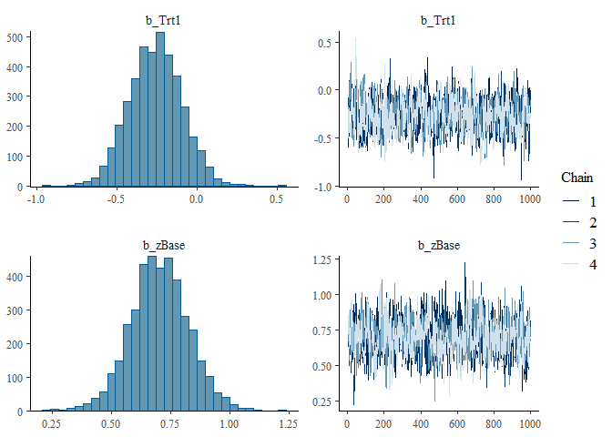

# stanflow


<!-- badges: start -->

[](https://github.com/VisruthSK/stanflow/actions/workflows/R-CMD-check.yaml)
[](https://github.com/VisruthSK/stanflow/actions/workflows/pkgdown.yaml)
<!-- badges: end -->

`stanflow` offers an integrated, mildly opinionated access to a
Stan-based [Bayesian Workflow](https://arxiv.org/abs/2011.01808) (Gelman
et al. 2020). Much like the famous [tidyverse
package](https://github.com/tidyverse/tidyverse), `stanflow` is a
metapackage which installs and attaches relevant Stan R packages,
serving as a one-stop-shop for Bayesian modelling. `stanflow` draws
heavy inspiration from `tidyverse`, and reuses portions of its
codebase–however, `stanflow` eschews `tidyverse` packages (i.e.,
`purrr`, `dplyr`, etc.) for base R whenever necessary.

## Installation

You can install the development version of stanflow from
[GitHub](https://github.com/) with:

``` r
# install.packages("pak")
pak::pak("VisruthSK/stanflow")
```

## Usage

Here, we load `stanflow` and decide to use `cmdstanr` as the backend for
`brms`.

``` r
library(stanflow)
setup_interface(
  interface = "brms",
  dev = FALSE,
  prefer_cmdstanr = TRUE,
  quiet = FALSE,
  force = FALSE,
  skip_setup = FALSE
)
#> ℹ Adding cmdstanr to setup because `prefer_cmdstanr = TRUE`
#> ℹ Attaching brms...
#> ℹ Configured brms: set `options(mc.cores = parallel::detectCores())` and `options(brms.backend = 'cmdstanr')`
#> ℹ Attaching cmdstanr...
#> The C++ toolchain required for CmdStan is setup properly!
#> ℹ Found CmdStan v2.37.0 at 'C:/Users/visru/.cmdstan/cmdstan-2.37.0'
#> ✔ Setup complete. brms, cmdstanr are attached; you do not need to run `library()`.
```

With these two commands (with the `setup_interface()` call being
unnecessarily verbose), users have access to everything they need to fit
and interrogate Bayesian models. Specifically, those two commands will
load the core stanflow packages: `bayesplot`, `loo`, `posterior`,
`projpred` and `shinystan`, as well as setup `brms` to use the
`cmdstanr` backend with as many cores as are available on your machine.
These package (inlcuding `brms` and `cmdstanr`) are all “`library()`d”
as well, so we can proceed with our analysis immediately.

``` r
set.seed(1234)
cmdstanr_example()
#>    variable   mean median   sd  mad     q5    q95 rhat ess_bulk ess_tail
#>  lp__       -66.02 -65.68 1.50 1.27 -68.96 -64.31 1.00     1723     2491
#>  alpha        0.38   0.38 0.22 0.22   0.02   0.74 1.00     4248     2403
#>  beta[1]     -0.66  -0.65 0.25 0.25  -1.07  -0.26 1.00     4006     2689
#>  beta[2]     -0.27  -0.27 0.23 0.23  -0.66   0.11 1.00     3799     2997
#>  beta[3]      0.68   0.67 0.27 0.27   0.24   1.14 1.00     4243     2892
#>  log_lik[1]  -0.52  -0.51 0.10 0.10  -0.69  -0.36 1.00     4343     2757
#>  log_lik[2]  -0.41  -0.39 0.15 0.15  -0.68  -0.19 1.00     4596     2817
#>  log_lik[3]  -0.50  -0.46 0.22 0.21  -0.91  -0.20 1.00     4308     3236
#>  log_lik[4]  -0.45  -0.44 0.15 0.15  -0.73  -0.23 1.00     3917     2693
#>  log_lik[5]  -1.19  -1.16 0.28 0.28  -1.68  -0.76 1.00     4649     2849
#> 
#>  # showing 10 of 105 rows (change via 'max_rows' argument or 'cmdstanr_max_rows' option)

fit1 <- brm(
  count ~ zAge + zBase * Trt + (1 | patient),
  data = epilepsy,
  family = poisson(),
  silent = TRUE,
  refresh = 0
)
#> Start sampling
#> Running MCMC with 4 chains, at most 20 in parallel...
#> 
#> Chain 1 finished in 18.5 seconds.
#> Chain 4 finished in 19.0 seconds.
#> Chain 3 finished in 19.1 seconds.
#> Chain 2 finished in 19.2 seconds.
#> 
#> All 4 chains finished successfully.
#> Mean chain execution time: 18.9 seconds.
#> Total execution time: 19.3 seconds.
summary(fit1)
#>  Family: poisson 
#>   Links: mu = log 
#> Formula: count ~ zAge + zBase * Trt + (1 | patient) 
#>    Data: epilepsy (Number of observations: 236) 
#>   Draws: 4 chains, each with iter = 2000; warmup = 1000; thin = 1;
#>          total post-warmup draws = 4000
#> 
#> Multilevel Hyperparameters:
#> ~patient (Number of levels: 59) 
#>               Estimate Est.Error l-95% CI u-95% CI Rhat Bulk_ESS Tail_ESS
#> sd(Intercept)     0.59      0.07     0.47     0.75 1.00      807     1782
#> 
#> Regression Coefficients:
#>            Estimate Est.Error l-95% CI u-95% CI Rhat Bulk_ESS Tail_ESS
#> Intercept      1.77      0.12     1.52     2.00 1.01      653     1224
#> zAge           0.09      0.09    -0.08     0.27 1.01      746     1180
#> zBase          0.70      0.12     0.47     0.94 1.00      828     1465
#> Trt1          -0.26      0.17    -0.59     0.06 1.00      674     1165
#> zBase:Trt1     0.06      0.16    -0.26     0.38 1.00      935     1570
#> 
#> Draws were sampled using sample(hmc). For each parameter, Bulk_ESS
#> and Tail_ESS are effective sample size measures, and Rhat is the potential
#> scale reduction factor on split chains (at convergence, Rhat = 1).

plot(fit1, variable = c("b_Trt1", "b_zBase"))
```



``` r

fit2 <- brm(
  count ~ zAge + zBase * Trt + (1 | patient) + (1 | obs),
  data = epilepsy,
  family = poisson(),
  silent = TRUE,
  refresh = 0
)
#> Start sampling
#> Running MCMC with 4 chains, at most 20 in parallel...
#> 
#> Chain 1 finished in 18.3 seconds.
#> Chain 4 finished in 18.3 seconds.
#> Chain 3 finished in 19.0 seconds.
#> Chain 2 finished in 20.7 seconds.
#> 
#> All 4 chains finished successfully.
#> Mean chain execution time: 19.1 seconds.
#> Total execution time: 20.8 seconds.
summary(fit2)
#>  Family: poisson 
#>   Links: mu = log 
#> Formula: count ~ zAge + zBase * Trt + (1 | patient) + (1 | obs) 
#>    Data: epilepsy (Number of observations: 236) 
#>   Draws: 4 chains, each with iter = 2000; warmup = 1000; thin = 1;
#>          total post-warmup draws = 4000
#> 
#> Multilevel Hyperparameters:
#> ~obs (Number of levels: 236) 
#>               Estimate Est.Error l-95% CI u-95% CI Rhat Bulk_ESS Tail_ESS
#> sd(Intercept)     0.37      0.04     0.29     0.46 1.01     1155     1688
#> 
#> ~patient (Number of levels: 59) 
#>               Estimate Est.Error l-95% CI u-95% CI Rhat Bulk_ESS Tail_ESS
#> sd(Intercept)     0.54      0.07     0.42     0.71 1.00     1180     2138
#> 
#> Regression Coefficients:
#>            Estimate Est.Error l-95% CI u-95% CI Rhat Bulk_ESS Tail_ESS
#> Intercept      1.72      0.12     1.49     1.97 1.00      961     1666
#> zAge           0.09      0.09    -0.08     0.26 1.00     1137     1859
#> zBase          0.71      0.12     0.46     0.94 1.00     1011     1473
#> Trt1          -0.26      0.17    -0.59     0.06 1.01      951     1400
#> zBase:Trt1     0.05      0.17    -0.27     0.39 1.00     1127     1621
#> 
#> Draws were sampled using sample(hmc). For each parameter, Bulk_ESS
#> and Tail_ESS are effective sample size measures, and Rhat is the potential
#> scale reduction factor on split chains (at convergence, Rhat = 1).

loo(fit1, fit2)
#> Warning: Found 7 observations with a pareto_k > 0.7 in model 'fit1'. We
#> recommend to set 'moment_match = TRUE' in order to perform moment matching for
#> problematic observations.
#> Warning: Found 57 observations with a pareto_k > 0.7 in model 'fit2'. We
#> recommend to set 'moment_match = TRUE' in order to perform moment matching for
#> problematic observations.
#> Output of model 'fit1':
#> 
#> Computed from 4000 by 236 log-likelihood matrix.
#> 
#>          Estimate   SE
#> elpd_loo   -672.0 37.4
#> p_loo        94.6 15.0
#> looic      1344.1 74.7
#> ------
#> MCSE of elpd_loo is NA.
#> MCSE and ESS estimates assume MCMC draws (r_eff in [0.4, 2.1]).
#> 
#> Pareto k diagnostic values:
#>                          Count Pct.    Min. ESS
#> (-Inf, 0.7]   (good)     229   97.0%   135     
#>    (0.7, 1]   (bad)        6    2.5%   <NA>    
#>    (1, Inf)   (very bad)   1    0.4%   <NA>    
#> See help('pareto-k-diagnostic') for details.
#> 
#> Output of model 'fit2':
#> 
#> Computed from 4000 by 236 log-likelihood matrix.
#> 
#>          Estimate   SE
#> elpd_loo   -595.1 14.0
#> p_loo       107.9  7.2
#> looic      1190.2 28.0
#> ------
#> MCSE of elpd_loo is NA.
#> MCSE and ESS estimates assume MCMC draws (r_eff in [0.4, 1.6]).
#> 
#> Pareto k diagnostic values:
#>                          Count Pct.    Min. ESS
#> (-Inf, 0.7]   (good)     179   75.8%   151     
#>    (0.7, 1]   (bad)       52   22.0%   <NA>    
#>    (1, Inf)   (very bad)   5    2.1%   <NA>    
#> See help('pareto-k-diagnostic') for details.
#> 
#> Model comparisons:
#>      elpd_diff se_diff
#> fit2   0.0       0.0  
#> fit1 -77.0      28.1
```

Code snippets above are taken from the [`brms`
README](https://paulbuerkner.com/brms/) but aren’t directly comparable.
