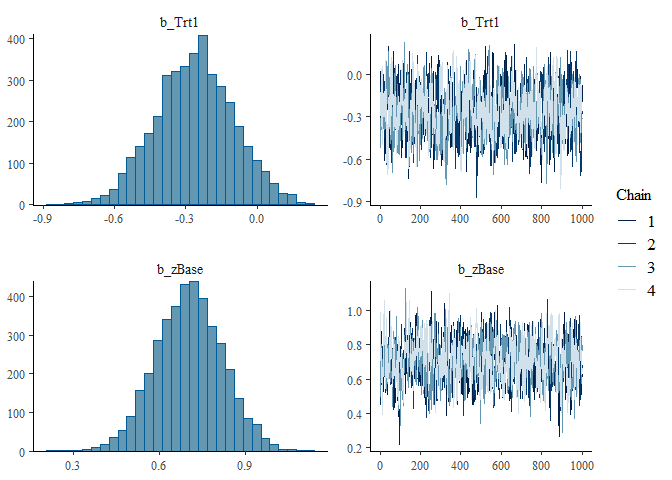

# stanflow


<!-- badges: start -->

[](https://github.com/VisruthSK/stanflow/actions/workflows/R-CMD-check.yaml)
[](https://github.com/VisruthSK/stanflow/actions/workflows/pkgdown.yaml)
<!-- badges: end -->


              █████                            ██████  ████                          
             ░░███                            ███░░███░░███                          
      █████  ███████    ██████   ████████    ░███ ░░░  ░███   ██████  █████ ███ █████
     ███░░  ░░░███░    ░░░░░███ ░░███░░███  ███████    ░███  ███░░███░░███ ░███░░███ 
    ░░█████   ░███      ███████  ░███ ░███ ░░░███░     ░███ ░███ ░███ ░███ ░███ ░███ 
     ░░░░███  ░███ ███ ███░░███  ░███ ░███   ░███      ░███ ░███ ░███ ░░███████████  
     ██████   ░░█████ ░░████████ ████ █████  █████     █████░░██████   ░░████░████   
    ░░░░░░     ░░░░░   ░░░░░░░░ ░░░░ ░░░░░  ░░░░░     ░░░░░  ░░░░░░     ░░░░ ░░░░    

## Installation

You can install the development version of stanflow from
[GitHub](https://github.com/) with:

``` r
# install.packages("pak")
pak::pak("VisruthSK/stanflow")
```

## Example

The package allows for quick access to the full Stan modelling pipeline,
with flexibility with regards to your fitting procedure. Here, we load
stanflow and decide to use cmdstanr as the backend for brms.

``` r
library(stanflow)
setup_interface(
  interface = "brms",
  dev = FALSE,
  prefer_cmdstanr = TRUE,
  quiet = FALSE,
  force = FALSE,
  skip_setup = FALSE
)
#> ℹ Adding cmdstanr to setup because `prefer_cmdstanr = TRUE`
#> ℹ Attaching brms...
#> ℹ Configured brms: set `options(mc.cores = parallel::detectCores())` and `options(brms.backend = 'cmdstanr')`
#> ℹ Attaching cmdstanr...
#> The C++ toolchain required for CmdStan is setup properly!
#> ℹ Found CmdStan v2.37.0 at 'C:/Users/visru/.cmdstan/cmdstan-2.37.0'
#> ✔ Setup complete. brms, cmdstanr are attached; you do not need to run `library()`.
```

With these two commands (with the `setup_interface()` call being
unnecessarily verbose), users have access to everything they need to fit
and analyze models. Specifically, those two commands will load the core
stanflow packages: `bayesplot`, `loo`, `posterior`, `projpred` and
`shinystan`, and setup `brms` to use the `cmdstanr` backend with as many
cores as are available on your machine. Those package are all
“`library()`d” as well, so we can proceed with our analysis immediately.

``` r
cmdstanr_example()
#>    variable   mean median   sd  mad     q5    q95 rhat ess_bulk ess_tail
#>  lp__       -65.95 -65.61 1.45 1.27 -68.78 -64.26 1.00     2018     2465
#>  alpha        0.38   0.37 0.22 0.22   0.03   0.75 1.00     4205     2866
#>  beta[1]     -0.67  -0.67 0.25 0.24  -1.09  -0.29 1.00     4245     3202
#>  beta[2]     -0.27  -0.28 0.23 0.21  -0.65   0.11 1.00     3573     3267
#>  beta[3]      0.68   0.68 0.27 0.26   0.25   1.12 1.00     3895     3115
#>  log_lik[1]  -0.51  -0.51 0.10 0.10  -0.68  -0.36 1.00     4094     3085
#>  log_lik[2]  -0.40  -0.38 0.15 0.14  -0.68  -0.20 1.00     4901     3537
#>  log_lik[3]  -0.50  -0.47 0.22 0.21  -0.89  -0.20 1.00     4227     2544
#>  log_lik[4]  -0.45  -0.43 0.15 0.14  -0.73  -0.24 1.00     4067     3150
#>  log_lik[5]  -1.18  -1.16 0.28 0.28  -1.69  -0.75 1.00     4355     2783
#> 
#>  # showing 10 of 105 rows (change via 'max_rows' argument or 'cmdstanr_max_rows' option)

# from brms readme:
fit1 <- brm(
  count ~ zAge + zBase * Trt + (1 | patient),
  data = epilepsy,
  family = poisson()
)
#> Start sampling
#> Running MCMC with 4 chains, at most 20 in parallel...
#> 
#> Chain 1 Iteration:    1 / 2000 [  0%]  (Warmup) 
#> Chain 2 Iteration:    1 / 2000 [  0%]  (Warmup) 
#> Chain 3 Iteration:    1 / 2000 [  0%]  (Warmup) 
#> Chain 4 Iteration:    1 / 2000 [  0%]  (Warmup) 
#> Chain 3 Iteration:  100 / 2000 [  5%]  (Warmup) 
#> Chain 2 Iteration:  100 / 2000 [  5%]  (Warmup) 
#> Chain 4 Iteration:  100 / 2000 [  5%]  (Warmup) 
#> Chain 1 Iteration:  100 / 2000 [  5%]  (Warmup) 
#> Chain 3 Iteration:  200 / 2000 [ 10%]  (Warmup) 
#> Chain 4 Iteration:  200 / 2000 [ 10%]  (Warmup) 
#> Chain 1 Iteration:  200 / 2000 [ 10%]  (Warmup) 
#> Chain 2 Iteration:  200 / 2000 [ 10%]  (Warmup) 
#> Chain 4 Iteration:  300 / 2000 [ 15%]  (Warmup) 
#> Chain 3 Iteration:  300 / 2000 [ 15%]  (Warmup) 
#> Chain 1 Iteration:  300 / 2000 [ 15%]  (Warmup) 
#> Chain 2 Iteration:  300 / 2000 [ 15%]  (Warmup) 
#> Chain 4 Iteration:  400 / 2000 [ 20%]  (Warmup) 
#> Chain 3 Iteration:  400 / 2000 [ 20%]  (Warmup) 
#> Chain 1 Iteration:  400 / 2000 [ 20%]  (Warmup) 
#> Chain 2 Iteration:  400 / 2000 [ 20%]  (Warmup) 
#> Chain 4 Iteration:  500 / 2000 [ 25%]  (Warmup) 
#> Chain 3 Iteration:  500 / 2000 [ 25%]  (Warmup) 
#> Chain 1 Iteration:  500 / 2000 [ 25%]  (Warmup) 
#> Chain 2 Iteration:  500 / 2000 [ 25%]  (Warmup) 
#> Chain 4 Iteration:  600 / 2000 [ 30%]  (Warmup) 
#> Chain 3 Iteration:  600 / 2000 [ 30%]  (Warmup) 
#> Chain 1 Iteration:  600 / 2000 [ 30%]  (Warmup) 
#> Chain 2 Iteration:  600 / 2000 [ 30%]  (Warmup) 
#> Chain 3 Iteration:  700 / 2000 [ 35%]  (Warmup) 
#> Chain 4 Iteration:  700 / 2000 [ 35%]  (Warmup) 
#> Chain 1 Iteration:  700 / 2000 [ 35%]  (Warmup) 
#> Chain 3 Iteration:  800 / 2000 [ 40%]  (Warmup) 
#> Chain 2 Iteration:  700 / 2000 [ 35%]  (Warmup) 
#> Chain 4 Iteration:  800 / 2000 [ 40%]  (Warmup) 
#> Chain 1 Iteration:  800 / 2000 [ 40%]  (Warmup) 
#> Chain 3 Iteration:  900 / 2000 [ 45%]  (Warmup) 
#> Chain 4 Iteration:  900 / 2000 [ 45%]  (Warmup) 
#> Chain 2 Iteration:  800 / 2000 [ 40%]  (Warmup) 
#> Chain 1 Iteration:  900 / 2000 [ 45%]  (Warmup) 
#> Chain 3 Iteration: 1000 / 2000 [ 50%]  (Warmup) 
#> Chain 2 Iteration:  900 / 2000 [ 45%]  (Warmup) 
#> Chain 3 Iteration: 1001 / 2000 [ 50%]  (Sampling) 
#> Chain 1 Iteration: 1000 / 2000 [ 50%]  (Warmup) 
#> Chain 4 Iteration: 1000 / 2000 [ 50%]  (Warmup) 
#> Chain 1 Iteration: 1001 / 2000 [ 50%]  (Sampling) 
#> Chain 4 Iteration: 1001 / 2000 [ 50%]  (Sampling) 
#> Chain 3 Iteration: 1100 / 2000 [ 55%]  (Sampling) 
#> Chain 1 Iteration: 1100 / 2000 [ 55%]  (Sampling) 
#> Chain 2 Iteration: 1000 / 2000 [ 50%]  (Warmup) 
#> Chain 4 Iteration: 1100 / 2000 [ 55%]  (Sampling) 
#> Chain 2 Iteration: 1001 / 2000 [ 50%]  (Sampling) 
#> Chain 3 Iteration: 1200 / 2000 [ 60%]  (Sampling) 
#> Chain 1 Iteration: 1200 / 2000 [ 60%]  (Sampling) 
#> Chain 2 Iteration: 1100 / 2000 [ 55%]  (Sampling) 
#> Chain 4 Iteration: 1200 / 2000 [ 60%]  (Sampling) 
#> Chain 1 Iteration: 1300 / 2000 [ 65%]  (Sampling) 
#> Chain 3 Iteration: 1300 / 2000 [ 65%]  (Sampling) 
#> Chain 4 Iteration: 1300 / 2000 [ 65%]  (Sampling) 
#> Chain 2 Iteration: 1200 / 2000 [ 60%]  (Sampling) 
#> Chain 1 Iteration: 1400 / 2000 [ 70%]  (Sampling) 
#> Chain 3 Iteration: 1400 / 2000 [ 70%]  (Sampling) 
#> Chain 4 Iteration: 1400 / 2000 [ 70%]  (Sampling) 
#> Chain 2 Iteration: 1300 / 2000 [ 65%]  (Sampling) 
#> Chain 1 Iteration: 1500 / 2000 [ 75%]  (Sampling) 
#> Chain 3 Iteration: 1500 / 2000 [ 75%]  (Sampling) 
#> Chain 4 Iteration: 1500 / 2000 [ 75%]  (Sampling) 
#> Chain 2 Iteration: 1400 / 2000 [ 70%]  (Sampling) 
#> Chain 1 Iteration: 1600 / 2000 [ 80%]  (Sampling) 
#> Chain 3 Iteration: 1600 / 2000 [ 80%]  (Sampling) 
#> Chain 4 Iteration: 1600 / 2000 [ 80%]  (Sampling) 
#> Chain 2 Iteration: 1500 / 2000 [ 75%]  (Sampling) 
#> Chain 3 Iteration: 1700 / 2000 [ 85%]  (Sampling) 
#> Chain 1 Iteration: 1700 / 2000 [ 85%]  (Sampling) 
#> Chain 4 Iteration: 1700 / 2000 [ 85%]  (Sampling) 
#> Chain 2 Iteration: 1600 / 2000 [ 80%]  (Sampling) 
#> Chain 1 Iteration: 1800 / 2000 [ 90%]  (Sampling) 
#> Chain 3 Iteration: 1800 / 2000 [ 90%]  (Sampling) 
#> Chain 4 Iteration: 1800 / 2000 [ 90%]  (Sampling) 
#> Chain 2 Iteration: 1700 / 2000 [ 85%]  (Sampling) 
#> Chain 3 Iteration: 1900 / 2000 [ 95%]  (Sampling) 
#> Chain 1 Iteration: 1900 / 2000 [ 95%]  (Sampling) 
#> Chain 4 Iteration: 1900 / 2000 [ 95%]  (Sampling) 
#> Chain 2 Iteration: 1800 / 2000 [ 90%]  (Sampling) 
#> Chain 1 Iteration: 2000 / 2000 [100%]  (Sampling) 
#> Chain 3 Iteration: 2000 / 2000 [100%]  (Sampling) 
#> Chain 1 finished in 15.8 seconds.
#> Chain 3 finished in 15.8 seconds.
#> Chain 4 Iteration: 2000 / 2000 [100%]  (Sampling) 
#> Chain 4 finished in 15.9 seconds.
#> Chain 2 Iteration: 1900 / 2000 [ 95%]  (Sampling) 
#> Chain 2 Iteration: 2000 / 2000 [100%]  (Sampling) 
#> Chain 2 finished in 17.2 seconds.
#> 
#> All 4 chains finished successfully.
#> Mean chain execution time: 16.2 seconds.
#> Total execution time: 17.3 seconds.
summary(fit1)
#>  Family: poisson 
#>   Links: mu = log 
#> Formula: count ~ zAge + zBase * Trt + (1 | patient) 
#>    Data: epilepsy (Number of observations: 236) 
#>   Draws: 4 chains, each with iter = 2000; warmup = 1000; thin = 1;
#>          total post-warmup draws = 4000
#> 
#> Multilevel Hyperparameters:
#> ~patient (Number of levels: 59) 
#>               Estimate Est.Error l-95% CI u-95% CI Rhat Bulk_ESS Tail_ESS
#> sd(Intercept)     0.58      0.07     0.46     0.73 1.00      955     1691
#> 
#> Regression Coefficients:
#>            Estimate Est.Error l-95% CI u-95% CI Rhat Bulk_ESS Tail_ESS
#> Intercept      1.77      0.11     1.54     2.00 1.01      810     1641
#> zAge           0.10      0.09    -0.08     0.27 1.01      699     1599
#> zBase          0.70      0.12     0.47     0.93 1.00      799     1635
#> Trt1          -0.26      0.16    -0.58     0.06 1.00      767     1505
#> zBase:Trt1     0.06      0.17    -0.26     0.40 1.01      801     1358
#> 
#> Draws were sampled using sample(hmc). For each parameter, Bulk_ESS
#> and Tail_ESS are effective sample size measures, and Rhat is the potential
#> scale reduction factor on split chains (at convergence, Rhat = 1).

plot(fit1, variable = c("b_Trt1", "b_zBase"))
```



``` r

fit2 <- brm(
  count ~ zAge + zBase * Trt + (1 | patient) + (1 | obs),
  data = epilepsy,
  family = poisson()
)
#> Start sampling
#> Running MCMC with 4 chains, at most 20 in parallel...
#> 
#> Chain 1 Iteration:    1 / 2000 [  0%]  (Warmup) 
#> Chain 2 Iteration:    1 / 2000 [  0%]  (Warmup) 
#> Chain 3 Iteration:    1 / 2000 [  0%]  (Warmup) 
#> Chain 4 Iteration:    1 / 2000 [  0%]  (Warmup) 
#> Chain 3 Iteration:  100 / 2000 [  5%]  (Warmup) 
#> Chain 1 Iteration:  100 / 2000 [  5%]  (Warmup) 
#> Chain 2 Iteration:  100 / 2000 [  5%]  (Warmup) 
#> Chain 4 Iteration:  100 / 2000 [  5%]  (Warmup) 
#> Chain 3 Iteration:  200 / 2000 [ 10%]  (Warmup) 
#> Chain 2 Iteration:  200 / 2000 [ 10%]  (Warmup) 
#> Chain 1 Iteration:  200 / 2000 [ 10%]  (Warmup) 
#> Chain 4 Iteration:  200 / 2000 [ 10%]  (Warmup) 
#> Chain 3 Iteration:  300 / 2000 [ 15%]  (Warmup) 
#> Chain 1 Iteration:  300 / 2000 [ 15%]  (Warmup) 
#> Chain 2 Iteration:  300 / 2000 [ 15%]  (Warmup) 
#> Chain 4 Iteration:  300 / 2000 [ 15%]  (Warmup) 
#> Chain 1 Iteration:  400 / 2000 [ 20%]  (Warmup) 
#> Chain 2 Iteration:  400 / 2000 [ 20%]  (Warmup) 
#> Chain 3 Iteration:  400 / 2000 [ 20%]  (Warmup) 
#> Chain 4 Iteration:  400 / 2000 [ 20%]  (Warmup) 
#> Chain 1 Iteration:  500 / 2000 [ 25%]  (Warmup) 
#> Chain 2 Iteration:  500 / 2000 [ 25%]  (Warmup) 
#> Chain 3 Iteration:  500 / 2000 [ 25%]  (Warmup) 
#> Chain 4 Iteration:  500 / 2000 [ 25%]  (Warmup) 
#> Chain 1 Iteration:  600 / 2000 [ 30%]  (Warmup) 
#> Chain 2 Iteration:  600 / 2000 [ 30%]  (Warmup) 
#> Chain 3 Iteration:  600 / 2000 [ 30%]  (Warmup) 
#> Chain 4 Iteration:  600 / 2000 [ 30%]  (Warmup) 
#> Chain 1 Iteration:  700 / 2000 [ 35%]  (Warmup) 
#> Chain 2 Iteration:  700 / 2000 [ 35%]  (Warmup) 
#> Chain 3 Iteration:  700 / 2000 [ 35%]  (Warmup) 
#> Chain 2 Iteration:  800 / 2000 [ 40%]  (Warmup) 
#> Chain 3 Iteration:  800 / 2000 [ 40%]  (Warmup) 
#> Chain 4 Iteration:  700 / 2000 [ 35%]  (Warmup) 
#> Chain 1 Iteration:  800 / 2000 [ 40%]  (Warmup) 
#> Chain 2 Iteration:  900 / 2000 [ 45%]  (Warmup) 
#> Chain 3 Iteration:  900 / 2000 [ 45%]  (Warmup) 
#> Chain 1 Iteration:  900 / 2000 [ 45%]  (Warmup) 
#> Chain 4 Iteration:  800 / 2000 [ 40%]  (Warmup) 
#> Chain 4 Iteration:  900 / 2000 [ 45%]  (Warmup) 
#> Chain 2 Iteration: 1000 / 2000 [ 50%]  (Warmup) 
#> Chain 3 Iteration: 1000 / 2000 [ 50%]  (Warmup) 
#> Chain 2 Iteration: 1001 / 2000 [ 50%]  (Sampling) 
#> Chain 3 Iteration: 1001 / 2000 [ 50%]  (Sampling) 
#> Chain 1 Iteration: 1000 / 2000 [ 50%]  (Warmup) 
#> Chain 1 Iteration: 1001 / 2000 [ 50%]  (Sampling) 
#> Chain 4 Iteration: 1000 / 2000 [ 50%]  (Warmup) 
#> Chain 4 Iteration: 1001 / 2000 [ 50%]  (Sampling) 
#> Chain 3 Iteration: 1100 / 2000 [ 55%]  (Sampling) 
#> Chain 1 Iteration: 1100 / 2000 [ 55%]  (Sampling) 
#> Chain 2 Iteration: 1100 / 2000 [ 55%]  (Sampling) 
#> Chain 4 Iteration: 1100 / 2000 [ 55%]  (Sampling) 
#> Chain 3 Iteration: 1200 / 2000 [ 60%]  (Sampling) 
#> Chain 1 Iteration: 1200 / 2000 [ 60%]  (Sampling) 
#> Chain 4 Iteration: 1200 / 2000 [ 60%]  (Sampling) 
#> Chain 3 Iteration: 1300 / 2000 [ 65%]  (Sampling) 
#> Chain 1 Iteration: 1300 / 2000 [ 65%]  (Sampling) 
#> Chain 2 Iteration: 1200 / 2000 [ 60%]  (Sampling) 
#> Chain 4 Iteration: 1300 / 2000 [ 65%]  (Sampling) 
#> Chain 3 Iteration: 1400 / 2000 [ 70%]  (Sampling) 
#> Chain 1 Iteration: 1400 / 2000 [ 70%]  (Sampling) 
#> Chain 3 Iteration: 1500 / 2000 [ 75%]  (Sampling) 
#> Chain 4 Iteration: 1400 / 2000 [ 70%]  (Sampling) 
#> Chain 1 Iteration: 1500 / 2000 [ 75%]  (Sampling) 
#> Chain 2 Iteration: 1300 / 2000 [ 65%]  (Sampling) 
#> Chain 4 Iteration: 1500 / 2000 [ 75%]  (Sampling) 
#> Chain 3 Iteration: 1600 / 2000 [ 80%]  (Sampling) 
#> Chain 1 Iteration: 1600 / 2000 [ 80%]  (Sampling) 
#> Chain 3 Iteration: 1700 / 2000 [ 85%]  (Sampling) 
#> Chain 4 Iteration: 1600 / 2000 [ 80%]  (Sampling) 
#> Chain 1 Iteration: 1700 / 2000 [ 85%]  (Sampling) 
#> Chain 2 Iteration: 1400 / 2000 [ 70%]  (Sampling) 
#> Chain 4 Iteration: 1700 / 2000 [ 85%]  (Sampling) 
#> Chain 3 Iteration: 1800 / 2000 [ 90%]  (Sampling) 
#> Chain 1 Iteration: 1800 / 2000 [ 90%]  (Sampling) 
#> Chain 4 Iteration: 1800 / 2000 [ 90%]  (Sampling) 
#> Chain 2 Iteration: 1500 / 2000 [ 75%]  (Sampling) 
#> Chain 3 Iteration: 1900 / 2000 [ 95%]  (Sampling) 
#> Chain 1 Iteration: 1900 / 2000 [ 95%]  (Sampling) 
#> Chain 4 Iteration: 1900 / 2000 [ 95%]  (Sampling) 
#> Chain 3 Iteration: 2000 / 2000 [100%]  (Sampling) 
#> Chain 3 finished in 19.8 seconds.
#> Chain 1 Iteration: 2000 / 2000 [100%]  (Sampling) 
#> Chain 1 finished in 20.2 seconds.
#> Chain 2 Iteration: 1600 / 2000 [ 80%]  (Sampling) 
#> Chain 4 Iteration: 2000 / 2000 [100%]  (Sampling) 
#> Chain 4 finished in 20.4 seconds.
#> Chain 2 Iteration: 1700 / 2000 [ 85%]  (Sampling) 
#> Chain 2 Iteration: 1800 / 2000 [ 90%]  (Sampling) 
#> Chain 2 Iteration: 1900 / 2000 [ 95%]  (Sampling) 
#> Chain 2 Iteration: 2000 / 2000 [100%]  (Sampling) 
#> Chain 2 finished in 24.9 seconds.
#> 
#> All 4 chains finished successfully.
#> Mean chain execution time: 21.3 seconds.
#> Total execution time: 25.0 seconds.
summary(fit2)
#>  Family: poisson 
#>   Links: mu = log 
#> Formula: count ~ zAge + zBase * Trt + (1 | patient) + (1 | obs) 
#>    Data: epilepsy (Number of observations: 236) 
#>   Draws: 4 chains, each with iter = 2000; warmup = 1000; thin = 1;
#>          total post-warmup draws = 4000
#> 
#> Multilevel Hyperparameters:
#> ~obs (Number of levels: 236) 
#>               Estimate Est.Error l-95% CI u-95% CI Rhat Bulk_ESS Tail_ESS
#> sd(Intercept)     0.37      0.04     0.29     0.46 1.00     1464     2305
#> 
#> ~patient (Number of levels: 59) 
#>               Estimate Est.Error l-95% CI u-95% CI Rhat Bulk_ESS Tail_ESS
#> sd(Intercept)     0.54      0.08     0.41     0.71 1.00     1148     1699
#> 
#> Regression Coefficients:
#>            Estimate Est.Error l-95% CI u-95% CI Rhat Bulk_ESS Tail_ESS
#> Intercept      1.72      0.12     1.48     1.95 1.00     1268     1715
#> zAge           0.10      0.09    -0.07     0.27 1.00     1269     2018
#> zBase          0.70      0.12     0.45     0.93 1.01     1341     1663
#> Trt1          -0.26      0.16    -0.58     0.06 1.00     1422     1700
#> zBase:Trt1     0.06      0.17    -0.27     0.40 1.00     1303     1611
#> 
#> Draws were sampled using sample(hmc). For each parameter, Bulk_ESS
#> and Tail_ESS are effective sample size measures, and Rhat is the potential
#> scale reduction factor on split chains (at convergence, Rhat = 1).

loo(fit1, fit2)
#> Warning: Found 7 observations with a pareto_k > 0.7 in model 'fit1'. We
#> recommend to set 'moment_match = TRUE' in order to perform moment matching for
#> problematic observations.
#> Warning: Found 59 observations with a pareto_k > 0.7 in model 'fit2'. We
#> recommend to set 'moment_match = TRUE' in order to perform moment matching for
#> problematic observations.
#> Output of model 'fit1':
#> 
#> Computed from 4000 by 236 log-likelihood matrix.
#> 
#>          Estimate   SE
#> elpd_loo   -670.0 36.0
#> p_loo        92.9 13.9
#> looic      1340.0 72.0
#> ------
#> MCSE of elpd_loo is NA.
#> MCSE and ESS estimates assume MCMC draws (r_eff in [0.4, 2.3]).
#> 
#> Pareto k diagnostic values:
#>                          Count Pct.    Min. ESS
#> (-Inf, 0.7]   (good)     229   97.0%   100     
#>    (0.7, 1]   (bad)        6    2.5%   <NA>    
#>    (1, Inf)   (very bad)   1    0.4%   <NA>    
#> See help('pareto-k-diagnostic') for details.
#> 
#> Output of model 'fit2':
#> 
#> Computed from 4000 by 236 log-likelihood matrix.
#> 
#>          Estimate   SE
#> elpd_loo   -595.8 14.0
#> p_loo       108.6  7.2
#> looic      1191.6 28.0
#> ------
#> MCSE of elpd_loo is NA.
#> MCSE and ESS estimates assume MCMC draws (r_eff in [0.4, 1.7]).
#> 
#> Pareto k diagnostic values:
#>                          Count Pct.    Min. ESS
#> (-Inf, 0.7]   (good)     177   75.0%   165     
#>    (0.7, 1]   (bad)       50   21.2%   <NA>    
#>    (1, Inf)   (very bad)   9    3.8%   <NA>    
#> See help('pareto-k-diagnostic') for details.
#> 
#> Model comparisons:
#>      elpd_diff se_diff
#> fit2   0.0       0.0  
#> fit1 -74.2      26.5
```
