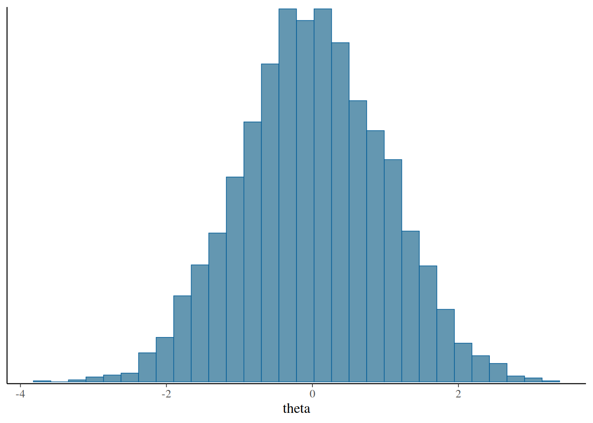

# stanflow: quick tour

`stanflow` is a lightweight metapackage that sets up a Stan-based
Bayesian workflow. It attaches a core toolkit for model analysis
(`posterior`, `loo`, `projpred`, `bayesplot`, `shinystan`) and helps you
install/configure Stan interfaces (`cmdstanr`, `rstan`, `brms`,
`rstanarm`).

## Attach `stanflow`

``` r
library(stanflow)
#> ── Attaching Stan processing packages ─────────────────── stanflow 0.0.0.9000 ──
#> ✔ bayesplot 1.15.0     ✔ projpred  2.10.0
#> ✔ loo       2.9.0      ✔ shinystan 2.7.0 
#> ✔ posterior 1.6.1
#> ── Available Stan interfaces ────────────────────────────── setup_interface() ──
#> • brms     2.23.0     • rstan    2.32.7
#> • cmdstanr 0.9.0      • rstanarm 2.32.2
#> ── Conflicts ─────────────────────────────────────────── stanflow_conflicts() ──
#> ✖ posterior::rhat() masks bayesplot::rhat()
#> ℹ Use the conflicted package (<http://conflicted.r-lib.org/>) to force all conflicts to become errors
stan_logo()
#>            G08GLG80G           
#>         G80LLLLLLLLL08G        
#>     G08GLLLLLLLLLLLLLLLG80G    
#>  G80LLLLLLLLLLLLLLCG08@@@@@@8G 
#> 8LLLLLLLLLLLC8@@@@@@@@@@@@@@@@@
#> 8LLLLLLLLL8@@@@@@@@@@@@@@800GC8
#> 8LLLLLLLL8@@@@80GCLLLLLLLLLLLL8
#> 8LLLLLLLGtiiiitfLLLLLLLLLLLLLL8
#> 8LLLLLLLfiiiiiiiii1fLLLLLLLLLL8
#> 8LLLLLLLLLLLLftiiiiiifLLLLLLLL8
#> 8LLLLLLLLLLLLLLLLLLLGLLLLLLLLL8
#> 8LLLLLLLLLLLLLG0@@0CLLLLLLLLLL8
#> 8LLLLCG0880GCLLLLLLLLLLLLLLLLL8
#>  G80LLLLLLLLLLLLLLLLLLLLGCG08G 
#>     G08GLLLLLLLLLLLLCGCG80G    
#>         G80LLLLLLLCL08G        
#>            G08GLG80G
```

Startup messages list attached packages and any namespace clashes. You
can re-print that status later with
[`flow_check()`](https://visruthsk.github.io/stanflow/reference/flow_check.md),
or just the namespace conflicts with
[`stanflow_conflicts()`](https://visruthsk.github.io/stanflow/reference/stanflow_conflicts.md).

``` r
flow_check()
#> ── Attaching Stan processing packages ─────────────────── stanflow 0.0.0.9000 ──
#> ✔ bayesplot 1.15.0     ✔ projpred  2.10.0
#> ✔ loo       2.9.0      ✔ shinystan 2.7.0 
#> ✔ posterior 1.6.1      
#> ── Available Stan interfaces ────────────────────────────── setup_interface() ──
#> • brms     2.23.0     • rstan    2.32.7
#> • cmdstanr 0.9.0      • rstanarm 2.32.2
#> ── Conflicts ─────────────────────────────────────────── stanflow_conflicts() ──
#> ✖ posterior::rhat() masks bayesplot::rhat()
#> ℹ Use the conflicted package (<http://conflicted.r-lib.org/>) to force all conflicts to become errors
stanflow_conflicts()
#> ── Conflicts ─────────────────────────────────────────── stanflow_conflicts() ──
#> ✖ posterior::rhat() masks bayesplot::rhat()
#> ℹ Use the conflicted package (<http://conflicted.r-lib.org/>) to force all conflicts to become errors
```

## Keep the flow fresh

Check whether your Stan workflow packages are up to date (stable
releases by default, or dev builds with `dev = TRUE`). Set `recursive`
to check the full dependency closure.

``` r
stanflow_update(recursive = TRUE)
```

## Choose interface backends

Use
[`setup_interface()`](https://visruthsk.github.io/stanflow/reference/setup_interface.md)
to install (if needed), attach, and configure interfaces. This example
prefers the `cmdstanr` backend for `brms`. Running this command will
attach both packages and ensure that `brms` calls rely on `cmdstanr` by
default.

``` r
setup_interface(
  interface = "brms",
  brms_backend = "cmdstanr",
  cores = 2,
  quiet = TRUE,
  force = TRUE # only required for non-interactive usage
)
#> * Latest CmdStan release is v2.38.0
#> * Installing CmdStan v2.38.0 in /home/runner/.cmdstan/cmdstan-2.38.0
#> * Downloading cmdstan-2.38.0.tar.gz from GitHub...
#> * Download complete
#> * Unpacking archive...
#> * Building CmdStan binaries...
#> ar: creating stan/lib/stan_math/lib/sundials_6.1.1/lib/libsundials_nvecserial.a
#> ar: creating stan/lib/stan_math/lib/sundials_6.1.1/lib/libsundials_cvodes.a
#> ar: creating stan/lib/stan_math/lib/sundials_6.1.1/lib/libsundials_idas.a
#> ar: creating stan/lib/stan_math/lib/sundials_6.1.1/lib/libsundials_kinsol.a
#> /home/runner/.cmdstan/cmdstan-2.38.0/stan/lib/stan_math/lib/tbb_2020.3/build/Makefile.tbb:28: CONFIG: cfg=release arch=intel64 compiler=gcc target=linux runtime=cc13.3.0_libc2.39_kernel6.11.0
#> In file included from ../tbb_2020.3/src/tbb/concurrent_hash_map.cpp:17:
#> ../tbb_2020.3/include/tbb/concurrent_hash_map.h:347:23: warning: ‘template<class _Category, class _Tp, class _Distance, class _Pointer, class _Reference> struct std::iterator’ is deprecated [-Wdeprecated-declarations]
#>   347 |         : public std::iterator<std::forward_iterator_tag,Value>
#>       |                       ^~~~~~~~
#> In file included from /usr/include/c++/13/bits/stl_construct.h:61,
#>                  from /usr/include/c++/13/bits/stl_tempbuf.h:61,
#>                  from /usr/include/c++/13/memory:66,
#>                  from ../tbb_2020.3/include/tbb/tbb_stddef.h:452,
#>                  from ../tbb_2020.3/include/tbb/concurrent_hash_map.h:23:
#> /usr/include/c++/13/bits/stl_iterator_base_types.h:127:34: note: declared here
#>   127 |     struct _GLIBCXX17_DEPRECATED iterator
#>       |                                  ^~~~~~~~
#> cc1plus: note: unrecognized command-line option ‘-Wno-unknown-warning-option’ may have been intended to silence earlier diagnostics
#> In file included from ../tbb_2020.3/src/tbb/concurrent_queue.cpp:22:
#> ../tbb_2020.3/include/tbb/internal/_concurrent_queue_impl.h:749:21: warning: ‘template<class _Category, class _Tp, class _Distance, class _Pointer, class _Reference> struct std::iterator’ is deprecated [-Wdeprecated-declarations]
#>   749 |         public std::iterator<std::forward_iterator_tag,Value> {
#>       |                     ^~~~~~~~
#> In file included from /usr/include/c++/13/bits/stl_construct.h:61,
#>                  from /usr/include/c++/13/bits/stl_tempbuf.h:61,
#>                  from /usr/include/c++/13/memory:66,
#>                  from ../tbb_2020.3/include/tbb/tbb_stddef.h:452,
#>                  from ../tbb_2020.3/src/tbb/concurrent_queue.cpp:17:
#> /usr/include/c++/13/bits/stl_iterator_base_types.h:127:34: note: declared here
#>   127 |     struct _GLIBCXX17_DEPRECATED iterator
#>       |                                  ^~~~~~~~
#> ../tbb_2020.3/include/tbb/internal/_concurrent_queue_impl.h:1013:21: warning: ‘template<class _Category, class _Tp, class _Distance, class _Pointer, class _Reference> struct std::iterator’ is deprecated [-Wdeprecated-declarations]
#>  1013 |         public std::iterator<std::forward_iterator_tag,Value> {
#>       |                     ^~~~~~~~
#> /usr/include/c++/13/bits/stl_iterator_base_types.h:127:34: note: declared here
#>   127 |     struct _GLIBCXX17_DEPRECATED iterator
#>       |                                  ^~~~~~~~
#> cc1plus: note: unrecognized command-line option ‘-Wno-unknown-warning-option’ may have been intended to silence earlier diagnostics
#> * Finished installing CmdStan to /home/runner/.cmdstan/cmdstan-2.38.0
#> CmdStan path set to: /home/runner/.cmdstan/cmdstan-2.38.0
flow_check()
#> ── Attaching Stan processing packages ─────────────────── stanflow 0.0.0.9000 ──
#> ✔ bayesplot 1.15.0     ✔ projpred  2.10.0
#> ✔ loo       2.9.0      ✔ shinystan 2.7.0 
#> ✔ posterior 1.6.1      
#> ── Available Stan interfaces ────────────────────────────── setup_interface() ──
#> ✔ brms     2.23.0     • rstan    2.32.7
#> ✔ cmdstanr 0.9.0      • rstanarm 2.32.2
#> ── Conflicts ─────────────────────────────────────────── stanflow_conflicts() ──
#> ✖ brms::ar()      masks stats::ar()
#> ✖ brms::do_call() masks projpred::do_call()
#> ✖ brms::rhat()    masks posterior::rhat(), bayesplot::rhat()
#> ℹ Use the conflicted package (<http://conflicted.r-lib.org/>) to force all conflicts to become errors
```

If you prefer `RStan`, you could load it alongside `brms`.

``` r
setup_interface(
  interface = c("rstan", "brms"),
  cores = 2,
  quiet = TRUE
)
```

You can setup as many interfaces you’d like:

``` r
setup_interface(
  interface = c("rstan", "rstanarm", "brms"),
  brms_backend = "cmdstanr",
  cores = 2,
  quiet = TRUE
)
```

## A tiny workflow

With the core packages attached, you can generate, summarise, and
visualise draws immediately.

``` r
set.seed(0)
draws <- as_draws_df(
  matrix(rnorm(4000), ncol = 1, dimnames = list(NULL, "theta"))
)
summarise_draws(draws, mean, sd, rhat, ess_bulk)
#> # A tibble: 1 × 5
#>   variable    mean    sd  rhat ess_bulk
#>   <chr>      <dbl> <dbl> <dbl>    <dbl>
#> 1 theta    0.00750 0.990  1.00    4038.
mcmc_hist(draws, pars = "theta")
#> `stat_bin()` using `bins = 30`. Pick better value `binwidth`.
```



``` r

log_lik <- matrix(rnorm(4000 * 10, -1, 0.2), ncol = 10)
loo(log_lik)
#> 
#> Computed from 4000 by 10 log-likelihood matrix.
#> 
#>          Estimate  SE
#> elpd_loo    -10.2 0.0
#> p_loo         0.4 0.0
#> looic        20.4 0.0
#> ------
#> MCSE of elpd_loo is 0.0.
#> MCSE and ESS estimates assume independent draws (r_eff=1).
#> 
#> All Pareto k estimates are good (k < 0.7).
#> See help('pareto-k-diagnostic') for details.
```

## Painless citations

Once you’ve finished your analysis and need to cite the Stan software
you used, simply run
[`stan_cite()`](https://visruthsk.github.io/stanflow/reference/stan_cite.md)
on your project/files to generate an appropriate BibTeX or bibentry.

``` r
start <- Sys.time()
stan_cite("stanflow.qmd")
#> ℹ Searching '/home/runner/work/stanflow/stanflow/vignettes/stanflow.qmd'
#> @Manual{bayesplot,
#>   title = {Plotting for Bayesian Models},
#>   author = {Jonah Gabry and Tristan Mahr},
#>   year = {2025},
#>   note = {R package version 1.15.0, https://discourse.mc-stan.org},
#>   url = {https://mc-stan.org/bayesplot/},
#> }
#> 
#> @Article{bayesplot-2019,
#>   title = {Visualization in Bayesian workflow},
#>   author = {Jonah Gabry and Daniel Simpson and Aki Vehtari and Michael Betancourt and Andrew Gelman},
#>   year = {2019},
#>   journal = {J. R. Stat. Soc. A},
#>   volume = {182},
#>   issue = {2},
#>   pages = {389-402},
#>   doi = {10.1111/rssa.12378},
#> }
#> 
#> @Manual{loo,
#>   title = {Efficient Leave-One-Out Cross-Validation and WAIC for Bayesian
#> Models},
#>   author = {Aki Vehtari and Jonah Gabry and Måns Magnusson and Yuling Yao and Paul-Christian Bürkner and Topi Paananen and Andrew Gelman},
#>   year = {2025},
#>   note = {R package version 2.9.0, https://discourse.mc-stan.org},
#>   url = {https://mc-stan.org/loo/},
#> }
#> 
#> @Manual{posterior,
#>   title = {Tools for Working with Posterior Distributions},
#>   author = {Paul-Christian Bürkner and Jonah Gabry and Matthew Kay and Aki Vehtari},
#>   year = {2025},
#>   note = {R package version 1.6.1, https://discourse.mc-stan.org},
#>   url = {https://mc-stan.org/posterior/},
#> }
#> 
#> @Article{rhat-2021,
#>   title = {Rank-normalization, folding, and localization: An improved Rhat for assessing convergence of MCMC (with discussion)},
#>   author = {Aki Vehtari and Andrew Gelman and Daniel Simpson and Bob Carpenter and Paul-Christian B\"urkner},
#>   journal = {Bayesian Analysis},
#>   year = {2021},
#>   volume = {16},
#>   number = {2},
#>   pages = {667-718},
#> }
#> 
#> @Manual{projpred,
#>   title = {Projection Predictive Feature Selection},
#>   author = {Juho Piironen and Markus Paasiniemi and Alejandro Catalina and Frank Weber and Osvaldo Martin and Aki Vehtari},
#>   year = {2025},
#>   note = {R package version 2.10.0, https://discourse.mc-stan.org},
#>   url = {https://mc-stan.org/projpred/},
#> }
#> 
#> @Manual{shinystan,
#>   title = {Interactive Visual and Numerical Diagnostics and Posterior
#> Analysis for Bayesian Models},
#>   author = {Jonah Gabry and Duco Veen},
#>   year = {2025},
#>   note = {R package version 2.7.0, https://discourse.mc-stan.org},
#>   url = {https://mc-stan.org/shinystan/},
#> }
#> 
#> @Manual{stanflow,
#>   title = {A Mildly Opinionated Stan Bayesian Workflow},
#>   author = {Visruth {Srimath Kandali}},
#>   year = {2026},
#>   note = {R package version 0.0.0.9000, https://discourse.mc-stan.org},
#>   url = {https://mc-stan.org/stanflow/},
#> }
#> 
#> @Article{vehtari-2017-loo,
#>   title = {Practical Bayesian model evaluation using leave-one-out cross-validation and WAIC},
#>   author = {Aki Vehtari and Andrew Gelman and Jonah Gabry},
#>   journal = {Statistics and Computing},
#>   year = {2017},
#>   volume = {27},
#>   number = {5},
#>   pages = {1413--1432},
#>   doi = {10.1007/s11222-016-9696-4},
#>   note = {arXiv preprint: https://arxiv.org/abs/1507.04544},
#> }
#> 
#> @Article{vehtari-2024-psis,
#>   title = {Pareto smoothed importance sampling},
#>   author = {Aki Vehtari and Daniel Simpson and Andrew Gelman and Yuling Yao and Jonah Gabry},
#>   journal = {Journal of Machine Learning Research},
#>   year = {2024},
#>   volume = {25},
#>   number = {72},
#>   pages = {1--58},
#>   url = {https://jmlr.org/papers/v25/19-556.html},
#> }
#> 
#> @Manual{,
#>   title = {R: A Language and Environment for Statistical Computing},
#>   author = {{R Core Team}},
#>   organization = {R Foundation for Statistical Computing},
#>   address = {Vienna, Austria},
#>   year = {2025},
#>   url = {https://www.R-project.org/},
#> }
Sys.time() - start
#> Time difference of 0.1516364 secs
```
