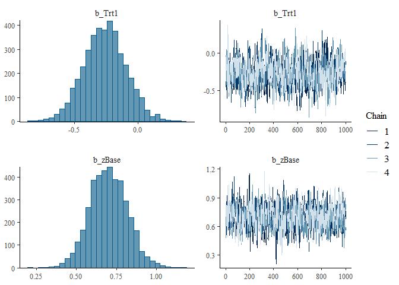

# stanflow (Stan Bayesian Workflow)

`stanflow` offers an integrated, mildly opinionated access to a
Stan-based [Bayesian Workflow](https://arxiv.org/abs/2011.01808) (Gelman
et al. 2020). Much like the famous [tidyverse
package](https://github.com/tidyverse/tidyverse), `stanflow` is a
metapackage which installs and attaches relevant Stan R packages,
serving as a one-stop-shop for Bayesian modelling. `stanflow` draws
heavy inspiration from `tidyverse`, and reuses portions of its
codebase–however, `stanflow` eschews `tidyverse` packages (i.e.,
`purrr`, `dplyr`, etc.) for base R whenever necessary.

## Installation

You can install the development version of stanflow from
[GitHub](https://github.com/) with:

``` r
# install.packages("pak")
pak::pak("VisruthSK/stanflow")
```

## Usage

Here, we load `stanflow` and decide to use `cmdstanr` as the backend for
`brms`.

``` r
library(stanflow)
setup_interface(
  interface = "brms",
  dev = FALSE,
  brms_backend = "cmdstanr",
  cores = 2,
  quiet = FALSE,
  force = FALSE,
  check_updates = TRUE
)
#> ℹ Adding cmdstanr to setup because `brms_backend = 'cmdstanr'`
#> ℹ Attaching brms...
#> ℹ Configured brms: set `options(mc.cores = 2)` and `options(brms.backend = 'cmdstanr')`
#> ℹ Attaching cmdstanr...
#> The C++ toolchain required for CmdStan is setup properly!
#> ℹ Found CmdStan v2.37.0 at 'C:/Users/visru/.cmdstan/cmdstan-2.37.0'
#> ✔ Setup complete. brms, cmdstanr are attached; you do not need to run `library()`.
set.seed(0)
flow_check()
#> ── Attaching Stan processing packages ─────────────────── stanflow 0.0.0.9000 ──
#> ✔ bayesplot 1.15.0         ✔ projpred  2.10.0    
#> ✔ loo       2.8.0.9000     ✔ shinystan 2.7.0     
#> ✔ posterior 1.6.1          
#> ── Available Stan interfaces ────────────────────────────── setup_interface() ──
#> ✔ brms     2.22.0          • rstan    2.36.0.9000
#> ✔ cmdstanr 0.9.0           • rstanarm 2.32.2     
#> ── Conflicts ─────────────────────────────────────────── stanflow_conflicts() ──
#> ✖ brms::ar()      masks stats::ar()
#> ✖ brms::do_call() masks projpred::do_call()
#> ✖ brms::rhat()    masks posterior::rhat(), bayesplot::rhat()
#> ℹ Use the conflicted package (<http://conflicted.r-lib.org/>) to force all conflicts to become errors
```

With the first two commands (note that the
[`setup_interface()`](https://visruthsk.github.io/stanflow/reference/setup_interface.md)
call is unnecessarily verbose), users have access to everything they
need to fit and interrogate Bayesian models. Specifically, those two
commands will load the core stanflow packages: `bayesplot`, `loo`,
`posterior`, `projpred` and `shinystan`, as well as setup `brms` to use
the `cmdstanr` backend with as many cores as are available on your
machine. These package (inlcuding `brms` and `cmdstanr`) are all
“[`library()`](https://rdrr.io/r/base/library.html)d” as well, so we can
proceed with our analysis immediately.

``` r
cmdstanr_example()
#>    variable   mean median   sd  mad     q5    q95 rhat ess_bulk ess_tail
#>  lp__       -65.94 -65.62 1.39 1.19 -68.67 -64.29 1.00     1996     2876
#>  alpha        0.38   0.37 0.21 0.22   0.03   0.74 1.00     4087     3110
#>  beta[1]     -0.67  -0.67 0.25 0.25  -1.09  -0.27 1.00     4516     2758
#>  beta[2]     -0.27  -0.26 0.22 0.22  -0.64   0.09 1.00     3520     3012
#>  beta[3]      0.67   0.66 0.27 0.27   0.24   1.12 1.00     4444     3098
#>  log_lik[1]  -0.51  -0.51 0.10 0.10  -0.68  -0.37 1.00     3705     3254
#>  log_lik[2]  -0.41  -0.39 0.15 0.14  -0.67  -0.20 1.00     4327     3192
#>  log_lik[3]  -0.50  -0.46 0.22 0.20  -0.91  -0.20 1.00     3433     2935
#>  log_lik[4]  -0.45  -0.43 0.15 0.15  -0.73  -0.24 1.00     3605     2931
#>  log_lik[5]  -1.18  -1.16 0.28 0.28  -1.67  -0.75 1.00     4895     3413
#> 
#>  # showing 10 of 105 rows (change via 'max_rows' argument or 'cmdstanr_max_rows' option)

fit1 <- brm(
  count ~ zAge + zBase * Trt + (1 | patient),
  data = epilepsy,
  family = poisson(),
  silent = TRUE,
  refresh = 0
)
#> Start sampling
#> Running MCMC with 4 chains, at most 20 in parallel...
#> 
#> Chain 1 finished in 8.1 seconds.
#> Chain 2 finished in 8.1 seconds.
#> Chain 3 finished in 8.1 seconds.
#> Chain 4 finished in 8.5 seconds.
#> 
#> All 4 chains finished successfully.
#> Mean chain execution time: 8.2 seconds.
#> Total execution time: 8.6 seconds.
summary(fit1)
#>  Family: poisson 
#>   Links: mu = log 
#> Formula: count ~ zAge + zBase * Trt + (1 | patient) 
#>    Data: epilepsy (Number of observations: 236) 
#>   Draws: 4 chains, each with iter = 2000; warmup = 1000; thin = 1;
#>          total post-warmup draws = 4000
#> 
#> Multilevel Hyperparameters:
#> ~patient (Number of levels: 59) 
#>               Estimate Est.Error l-95% CI u-95% CI Rhat Bulk_ESS Tail_ESS
#> sd(Intercept)     0.58      0.07     0.46     0.74 1.01      751     1459
#> 
#> Regression Coefficients:
#>            Estimate Est.Error l-95% CI u-95% CI Rhat Bulk_ESS Tail_ESS
#> Intercept      1.76      0.12     1.53     1.99 1.01      728     1469
#> zAge           0.09      0.08    -0.07     0.26 1.00      848     1597
#> zBase          0.70      0.12     0.46     0.94 1.00      816     1347
#> Trt1          -0.26      0.17    -0.57     0.07 1.00      714     1196
#> zBase:Trt1     0.05      0.17    -0.28     0.38 1.00      904     1528
#> 
#> Draws were sampled using sample(hmc). For each parameter, Bulk_ESS
#> and Tail_ESS are effective sample size measures, and Rhat is the potential
#> scale reduction factor on split chains (at convergence, Rhat = 1).

plot(fit1, variable = c("b_Trt1", "b_zBase"))
```



``` r

fit2 <- brm(
  count ~ zAge + zBase * Trt + (1 | patient) + (1 | obs),
  data = epilepsy,
  family = poisson(),
  silent = TRUE,
  refresh = 0
)
#> Start sampling
#> Running MCMC with 4 chains, at most 20 in parallel...
#> 
#> Chain 1 finished in 10.9 seconds.
#> Chain 4 finished in 10.9 seconds.
#> Chain 2 finished in 11.0 seconds.
#> Chain 3 finished in 11.5 seconds.
#> 
#> All 4 chains finished successfully.
#> Mean chain execution time: 11.1 seconds.
#> Total execution time: 11.7 seconds.
summary(fit2)
#>  Family: poisson 
#>   Links: mu = log 
#> Formula: count ~ zAge + zBase * Trt + (1 | patient) + (1 | obs) 
#>    Data: epilepsy (Number of observations: 236) 
#>   Draws: 4 chains, each with iter = 2000; warmup = 1000; thin = 1;
#>          total post-warmup draws = 4000
#> 
#> Multilevel Hyperparameters:
#> ~obs (Number of levels: 236) 
#>               Estimate Est.Error l-95% CI u-95% CI Rhat Bulk_ESS Tail_ESS
#> sd(Intercept)     0.37      0.04     0.29     0.46 1.00     1349     1967
#> 
#> ~patient (Number of levels: 59) 
#>               Estimate Est.Error l-95% CI u-95% CI Rhat Bulk_ESS Tail_ESS
#> sd(Intercept)     0.54      0.07     0.41     0.70 1.00     1125     1797
#> 
#> Regression Coefficients:
#>            Estimate Est.Error l-95% CI u-95% CI Rhat Bulk_ESS Tail_ESS
#> Intercept      1.72      0.12     1.49     1.95 1.00     1088     2092
#> zAge           0.09      0.09    -0.09     0.26 1.00     1055     1569
#> zBase          0.70      0.12     0.47     0.94 1.00      971     1557
#> Trt1          -0.26      0.16    -0.59     0.06 1.00      922     1751
#> zBase:Trt1     0.06      0.16    -0.26     0.37 1.00     1045     1803
#> 
#> Draws were sampled using sample(hmc). For each parameter, Bulk_ESS
#> and Tail_ESS are effective sample size measures, and Rhat is the potential
#> scale reduction factor on split chains (at convergence, Rhat = 1).

loo(fit1, fit2)
#> Warning: Found 6 observations with a pareto_k > 0.7 in model 'fit1'. We
#> recommend to set 'moment_match = TRUE' in order to perform moment matching for
#> problematic observations.
#> Warning: Found 58 observations with a pareto_k > 0.7 in model 'fit2'. We
#> recommend to set 'moment_match = TRUE' in order to perform moment matching for
#> problematic observations.
#> Output of model 'fit1':
#> 
#> Computed from 4000 by 236 log-likelihood matrix.
#> 
#>          Estimate   SE
#> elpd_loo   -671.9 36.8
#> p_loo        94.4 14.5
#> looic      1343.8 73.6
#> ------
#> MCSE of elpd_loo is NA.
#> MCSE and ESS estimates assume MCMC draws (r_eff in [0.4, 2.2]).
#> 
#> Pareto k diagnostic values:
#>                          Count Pct.    Min. ESS
#> (-Inf, 0.7]   (good)     230   97.5%   142     
#>    (0.7, 1]   (bad)        5    2.1%   <NA>    
#>    (1, Inf)   (very bad)   1    0.4%   <NA>    
#> See help('pareto-k-diagnostic') for details.
#> 
#> Output of model 'fit2':
#> 
#> Computed from 4000 by 236 log-likelihood matrix.
#> 
#>          Estimate   SE
#> elpd_loo   -594.6 13.9
#> p_loo       107.2  7.1
#> looic      1189.1 27.7
#> ------
#> MCSE of elpd_loo is NA.
#> MCSE and ESS estimates assume MCMC draws (r_eff in [0.4, 1.7]).
#> 
#> Pareto k diagnostic values:
#>                          Count Pct.    Min. ESS
#> (-Inf, 0.7]   (good)     178   75.4%   248     
#>    (0.7, 1]   (bad)       55   23.3%   <NA>    
#>    (1, Inf)   (very bad)   3    1.3%   <NA>    
#> See help('pareto-k-diagnostic') for details.
#> 
#> Model comparisons:
#>      elpd_diff se_diff
#> fit2   0.0       0.0  
#> fit1 -77.3      27.4
```

Code snippets above are taken from the [`brms`
README](https://paulbuerkner.com/brms/) but aren’t directly comparable.
